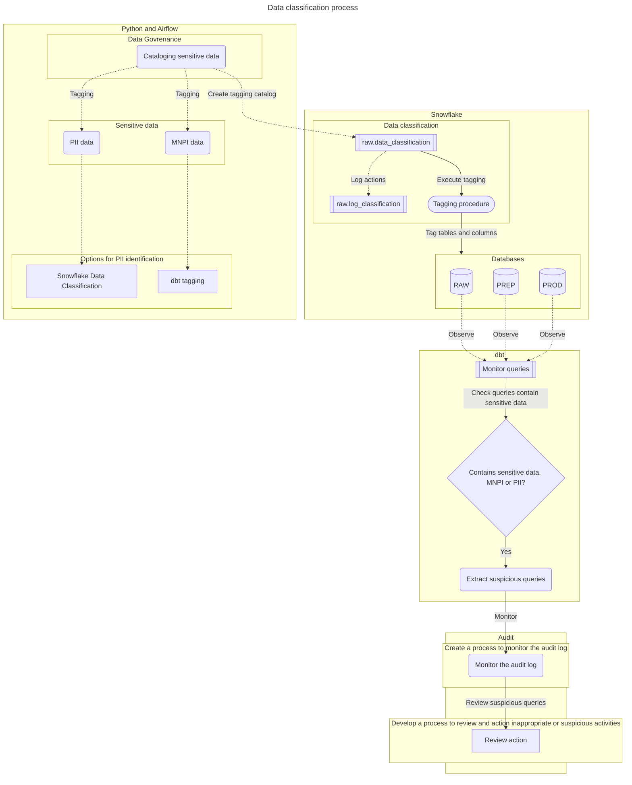

# Data classification

Support the following data:
* `MNPI` data - identified using `MNPI` tag from [GitLab dbt](https://dbt.gitlabdata.com/) project
* `PII` data - identify using [SYSTEM$CLASSIFY](https://docs.snowflake.com/en/sql-reference/stored-procedures/system_classify) Snowflake (built in) procedure 

The data classification process will be triggered manually, once per quarter to tag data and check which queries are potential security threats from the perspective of accessing `PII` or `MNPI` data.


## Data classification high-level design 



 
## Code details

### Airflow

The code is triggered in the Airflow (DAG=`DataClassification`) and the following parameters can be set up in the variables:

1. `DATA_CLASSIFICATION_TAGGING_TYPE` (default=`INCREMENTAL`) - define if the classification process is either `FULL` (will look for all tables, despite the moment of creation) or `INCREMENTAL` (look for newly created table)
1. `DATA_CLASSIFICATION_UNSET` (default=`FALSE`) - `TRUE` - will tag the data, `FALSE` - will drop existing tags. The parameter is represented in UPPERCASE 
1. `DATA_CLASSIFICATION_DAYS` (default=`90`) - this is in correlation with the parameter `DATA_CLASSIFICATION_TAGGING_TYPE`=`INCREMENTAL`. In case the load is `INCREMENTAL`, the parameter determine how long back will tag the data _(depends on the date when table or view is created)_ 


### Python
The code defines a `DataClassification` class that handles data classification for `PII` (Personally Identifiable Information) and `MNPI` (Material Non-Public Information) in a Snowflake database environment. The class `DataClassification` provides a comprehensive solution for classifying sensitive data (`PII` and `MNPI`) in the Snowflake environment, including data loading, transformation, classification, and tagging to the appropriate database tables. The main entry point for the code is in the `extract.py` unit.

Input parameters:

1. `operation`, - which stage for data classification is called:
    * `EXTRACT` 
    * `CLASSIFY`
1. `date_from` - running date of the DAG _(if not determine, the value is a present day)_
1. `unset` - `TRUE` - will tag the data, `FALSE` - will drop existing tags. The parameter is represented in UPPERCASE
1. `tagging_type` - define if the classification process is either `FULL` (will look for all tables, despite the moment of creation) or `INCREMENTAL` (look for newly created table)
1. `incremental_load_days` - this is in correlation with the parameter `DATA_CLASSIFICATION_TAGGING_TYPE`=`INCREMENTAL`. In case the load is `INCREMENTAL`, the parameter determine how long back will tag the data _(depends on the date when table or view is created)_

#### Stages

* `EXTRACT` - get all details about the objects should be classified and uploaded the list in Snowflake. Data landed in the table `RAW.DATA_CLASSIFICAION.SENSITIVE_OBJECTS_CLASSIFICATION`
* `CLASSIFY` - tagging the data based on the result from the `EXTRACT` stage. From the table `RAW.DATA_CLASSIFICAION.SENSITIVE_OBJECTS_CLASSIFICATION` data is called in the loop and tagg (classified) either with `PII` or `MNPI` tag(s)

### SQL code

This code is needed to run for the first time to create needed objects:

```sql
USE DATABASE RAW;
USE SCHEMA data_classification;

CREATE OR REPLACE TAG MNPI_DATA allowed_values 'no', 'yes' COMMENT='MNPI content flag';
    
CREATE OR REPLACE TABLE log_classification

(
 log_level    VARCHAR   DEFAULT 'INFO',
 log_text     VARCHAR,
 log_user     VARCHAR   DEFAULT CURRENT_USER,
 _uploaded_at TIMESTAMP DEFAULT CURRENT_TIMESTAMP
 );
```